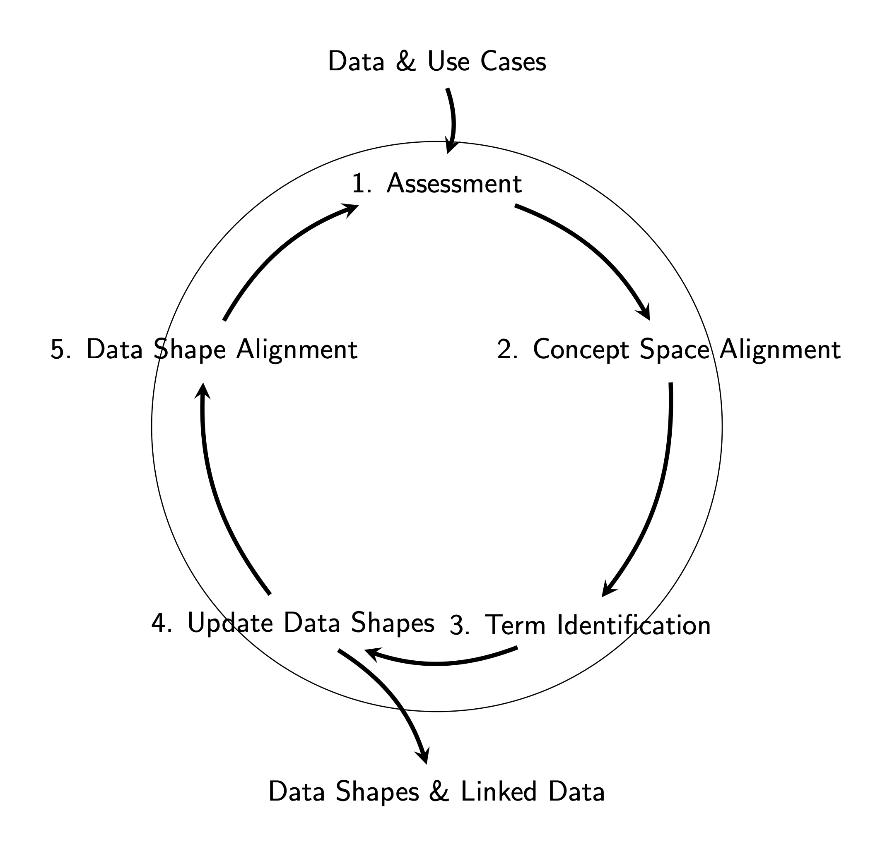

Naca Shapes
=======
The purpose of this project is to develop a set of data shapes for the NACA project.
The data shapes are developed in close collaboration with domain experts on the selected topics.
These shapes will be expressed in the Shape Expression language (ShEx) which can be used to validate
existing data on conformance to the data shapes.

This chapter provides a brief introduction into the steps involved in developing data shapes, their maintenance and their use.
The overall process consists of the following steps:
1. Bring together domain experts and data experts
2. Identify the use cases
3. Identify the available data
4. Draft a boxology (data model) in close collaboration with the domain experts and the data experts
5. Express the boxology in ShEx
6. Validate the ShEx against the data
7. Iterate over the boxology and the ShEx until the data is fully described
8. Provide some illustrative examples of the data and its use

The steps are described in more detail in the following sections. The diagram below illustrates the proces of semantic modelling and the development of data shapes.

