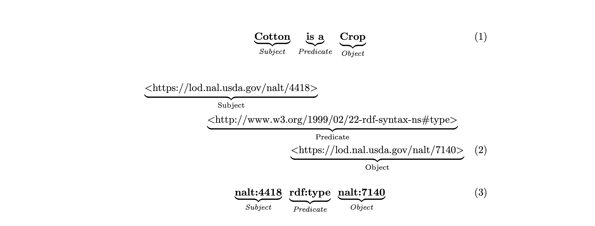

A preamble into linked (open) data
=============
Expressing data as linked (open) data is a process that requires a certain amount of effort.
In essence it is a two step process:
1. Standardize the data into so-called triples
2. Identify universally unique identifiers (URIs) for the concepts in the triples

# Standardize into triples. 
Data comes in many formats and shapes. Integration and aggregation of such source data can be laborious and error prone, or
even impossible. To overcome this problem the linked-data community has developed a standard way to represent data, called
the Resource Description Framework (RDF). RDF presents a standard way to represent data as triples, where a triple is a
statement that consists of three parts: a subject, a predicate and an object. 

*Representation of a triple:* **1. Described in human-readable notation,** **2. Expressed using unified resource identifiers (URIs),** *and* **3. Conveyed in a concise notation with prefixes for enhanced human readability.**

# Using universally unique identifiers (URIs)
The figure above shows three different ways to represent the same triple. The first representation is a human-readable representation
only. It remain prone to errors and is as such not suitable for machine processing. The second representation uses URIs to identify
the subject, predicate and object. URIs are a way to uniquely identify a concept. In ths example - and in the remainder of this book - we
primarily use URIs from NALT, which is a concept space that is maintained by the USDA. The third representation is a more concise version
of the second representation. It uses prefixes to shorten the URIs. The prefixes are defined in the header of the document.

For a more indepth explanation of RDF and the use of URIs we refer to the many excellent tutorials on the web.
For example the [W3C RDF primer](https://www.w3.org/TR/rdf11-primer/).

